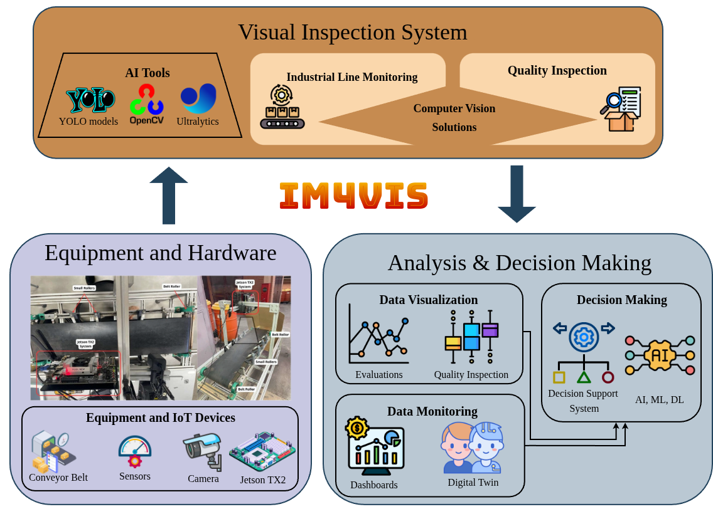
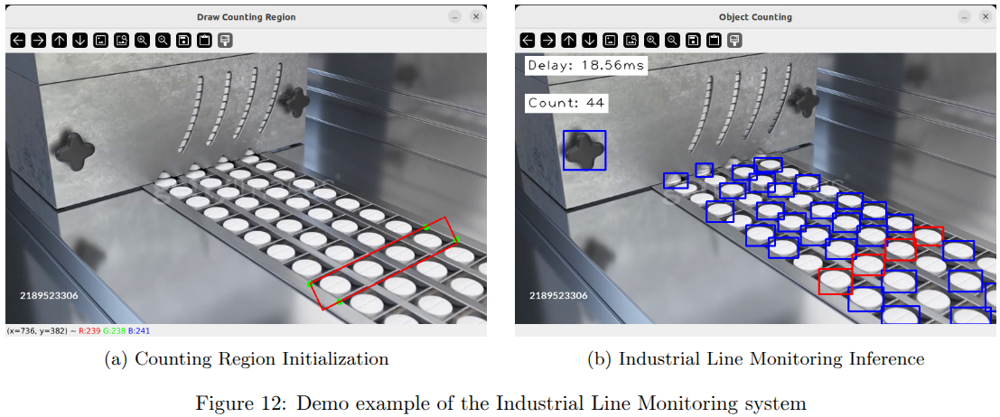
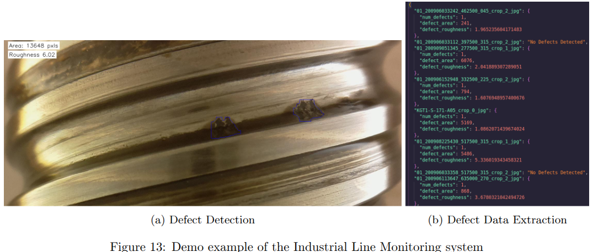

# Improving Industrial Manufacturing Production Efficiency using SOTA IM4VIS

This repository represents a theoritical system built originally as an assignment for a course regarding Industry 4.0 (Artificial Intelligence). 
It contains two computer vision-based examples with the goal of improving industrial manufacturing production. 

<div style="display: flex; justify-content: center;">
  
</div>


## Methodologies
### Industrial Line Monitoring 🏭
The **Industrial Line Monitoring** system utilizes the best performing detection YOLO model from a selection of evaluated models trained under the Medical Pills dataset. The model we utilized for this system is YOLOv8x that aims to detect medical pills in conveyor belts. Additionally, it combines tracking techniques to count medical pills in a video. The counting methodology works by drawing a region of interest in the image as illustrated in the Figre by pressing '$s$' to submit the region, otherwise '$q$' to close the program.


<div style="display: flex; justify-content: center;">
  
</div>


### Quality Inspection 🔍
The **Quality Inspection system** utilizes the best performing segmentation YOLO model from a selection of evaluated models trained under the BSData dataset. The model we utilized for this system is YOLOv12X that aims to effectively detect defects from incoming machinery components. Furthermore, once each defect is detected in each image various data is extracted for each defect into a '$.json$' file such as Area Size (in pixels) and surface roughness.
<div style="display: flex; justify-content: center;">
  
</div>


## Model Comparison 📊
The table below presents a comparison of different YOLO variants (v8, v11, v12) on two datasets: **BSData** [1] for segmentation and **Medical-Pills** [2] for object detection. Performance is reported in terms of **mAP₅₀** and **mAP₅₀:₉₅**. Bold values indicate the highest scores per column, while strikethrough values highlight the lowest.

| **Model**       | **Params (M)**   | **GFLOPs**       | **BSData [1]** (Seg.) |            | **Medical-Pills [2]** (Det.) |            |
|-----------------|------------------|------------------|------------------------|------------|------------------------------|------------|
|                 |                  |                  | **mAP₅₀**             | **mAP₅₀:₉₅** | **mAP₅₀**                     | **mAP₅₀:₉₅** |
| YOLOv8m [3]     | 27.22 / 25.84    | 110.0 / 78.7     | 0.751                 | 0.483       | 0.992                         | 0.819       |
| YOLOv8l         | 45.91 / 43.60    | 220.1 / 164.8    | 0.744                 | 0.486       | 0.993                         | 0.830       |
| YOLOv8x         | 71.72 / 68.12    | 343.7 / 257.4    | 0.705 🔴         | 0.453 🔴 | **0.993** ✅                  | **0.832** ✅ |
| YOLOv11m [4]    | 22.33 / 20.03    | 123.0 / 67.6     | 0.757                 | 0.467       | 0.992 🔴                 | 0.813 🔴 |
| YOLOv11l        | 27.58 / 25.28    | 141.9 / 86.6     | 0.729                 | 0.453       | 0.993                         | 0.829       |
| YOLOv11x        | 62.00 / 56.82    | 318.5 / 194.4    | 0.713                 | 0.457       | 0.993                         | 0.827       |
| YOLOv12m [5]    | 21.93 / 20.10    | 114.9 / 67.1     | 0.791                 | 0.503       | 0.993                         | 0.828       |
| YOLOv12l        | 28.16 / 26.33    | 136.3 / 88.5     | 0.776                 | 0.475       | 0.993                         | 0.826       |
| YOLOv12x        | 63.14 / 59.04    | 305.6 / 198.5    | **0.801** ✅          | **0.511** ✅ | 0.993                         | 0.827       |

[1]: Schlagenhauf, T., & Landwehr, M. (2021). *Industrial machine tool component surface defect dataset*. Data in Brief, 39, 107643. https://doi.org/10.1016/j.dib.2021.107643  
[2]: Jocher, G., & Rizwan, M. (2024). *Ultralytics Datasets: Medical-pills Detection Dataset*. https://docs.ultralytics.com/datasets/detect/medical-pills/  
[3]: Jocher, G. (2024). *YOLOv8 – Ultralytics*. https://github.com/ultralytics/ultralytics  
[4]: Mpouziotas, D. (2024). *YOLOv11*. https://github.com/mpouziotasd/YOLOv11  
[5]: Mpouziotas, D. (2024). *YOLOv12*. https://github.com/mpouziotasd/YOLOv12


## Citations

If you use this work, please cite the project and the datasets if necessary:

### Project 📌

```bibtex
@misc{mpouziotasd2024industrial,
  author       = {Mpouziotas, Dimitrios},
  title        = {Industrial-Automation-IM4VIS-Visual-Inspection-System},
  year         = {2024},
  publisher    = {GitHub},
  journal      = {GitHub repository},
  howpublished = {\url{https://github.com/mpouziotasd/Industrial-Automation-IM4VIS-Visual-Inspection-System}}
}
```

### Medical Pills 💊 Dataset 

```bibtex
@dataset{Jocher_Ultralytics_Datasets_2024,
  author  = {Jocher, Glenn and Rizwan, Muhammad},
  license = {AGPL-3.0},
  month   = {Dec},
  title   = {Ultralytics Datasets: Medical-pills Detection Dataset},
  url     = {https://docs.ultralytics.com/datasets/detect/medical-pills/},
  version = {1.0.0},
  year    = {2024}
}
```

### BSData Dataset 🛠

```bibtex
@article{BSData,
  title     = {Industrial machine tool component surface defect dataset},
  author    = {Schlagenhauf, Tobias and Landwehr, Magnus},
  journal   = {Data in Brief},
  volume    = {39},
  pages     = {107643},
  year      = {2021},
  publisher = {Elsevier}
}
```
